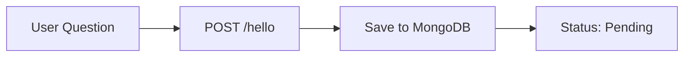
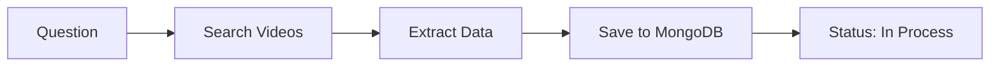
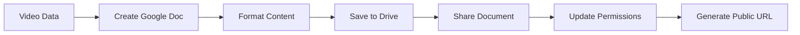
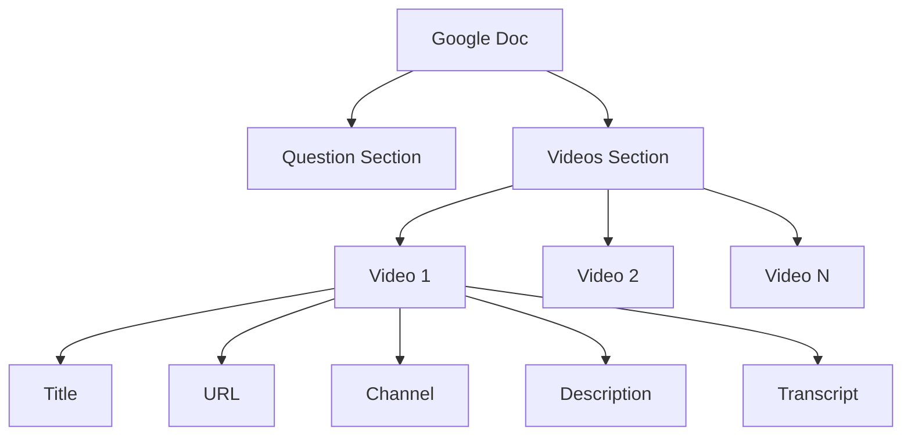
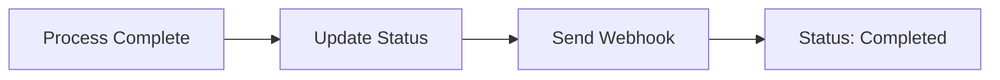

# 🎥 YouTube Video Search & Analysis System

A powerful system that searches YouTube videos, analyzes their content, and organizes results in Google Docs. Built with Node.js, Express, and MongoDB.

## 🌟 Features

- **Smart Video Search**: Find relevant YouTube videos based on your questions
- **Transcript Analysis**: Extract and analyze video transcripts
- **Google Docs Integration**: 
  - Automatically creates organized documents with search results
  - Saves all video information in a structured format
  - Creates a dedicated folder in Google Drive
  - Makes documents easily shareable
  - Maintains a clean, readable format
- **Real-time Status Tracking**: Monitor the progress of your searches
- **Webhook Notifications**: Get instant updates when processing is complete

## 🔄 Data Flow

### 1. Question Submission


### 2. Video Processing


### 3. Google Docs Creation & Saving


### 4. Document Structure


### 5. Completion


## 🛠️ Technical Stack

- **Backend**: Node.js, Express.js
- **Database**: MongoDB
- **APIs**: 
  - YouTube API
  - Google Drive API
  - Google Docs API
  - Brightdata API
- **Authentication**: Google OAuth2
- **Document Management**: Google Drive & Docs API

## 📦 Installation

1. Clone the repository:
   ```bash
   git clone [repository-url]
   cd agent_orc
   ```

2. Install dependencies:
   ```bash
   npm install
   ```

3. Set up environment variables:
   ```bash
   # Create .env file with:
   GOOGLE_TYPE=service_account
   GOOGLE_PROJECT_ID=your-project-id
   GOOGLE_PRIVATE_KEY_ID=your-private-key-id
   GOOGLE_PRIVATE_KEY=your-private-key
   GOOGLE_CLIENT_EMAIL=your-client-email
   GOOGLE_CLIENT_ID=your-client-id
   GOOGLE_AUTH_URI=https://accounts.google.com/o/oauth2/auth
   GOOGLE_TOKEN_URI=https://oauth2.googleapis.com/token
   GOOGLE_AUTH_PROVIDER_X509_CERT_URL=https://www.googleapis.com/oauth2/v1/certs
   GOOGLE_CLIENT_X509_CERT_URL=your-cert-url
   GOOGLE_UNIVERSE_DOMAIN=googleapis.com
   ```

4. Start the server:
   ```bash
   npm start
   ```

## 🚀 API Endpoints

### POST /hello
Submit a question to search for videos
```json
{
  "question": "Your question here"
}
```
Response:
```json
{
  "success": true,
  "questionId": "unique-id",
  "status": "inprocess",
  "documentId": "google-doc-id",
  "documentUrl": "google-doc-url"
}
```

### POST /fetch-transcripts
Get video transcripts
```json
{
  "url": "youtube-video-url"
}
```

### POST /test-webhook
Test webhook functionality
```json
{
  "questionId": "your-question-id"
}
```

## 📝 Data Structure

### Question Document
```json
{
  "question": "String",
  "status": "pending|inprocess|completed",
  "date": "Date",
  "videoId": "ObjectId",
  "documentId": "String",
  "documentUrl": "String"
}
```

### Video Document
```json
{
  "url": "String",
  "title": "String",
  "channelUrl": "String",
  "transcript": [{
    "start_time": "Number",
    "end_time": "Number",
    "duration": "Number",
    "text": "String"
  }],
  "description": "String",
  "questionId": "ObjectId"
}
```

### Google Doc Structure
```markdown
# Question: [Your Question]

## Videos Found

### Video 1
- Title: [Video Title]
- URL: [Video URL]
- Channel: [Channel URL]
- Description: [Video Description]
- Transcript: [Video Transcript]

### Video 2
...
```

## 🔒 Security

- Google API credentials are required
- Environment variables for sensitive data
- Secure webhook endpoints
- MongoDB connection security
- Google Drive folder permissions
- Document sharing settings

## 📊 Monitoring

- Real-time status updates
- Error logging
- Webhook notifications
- Google Drive document tracking
- Document access monitoring
- Permission changes logging

## 🤝 Contributing

1. Fork the repository
2. Create your feature branch
3. Commit your changes
4. Push to the branch
5. Create a Pull Request

## 📄 License

This project is licensed under the ISC License.

## 👥 Authors

- Your Name - Initial work

## 🙏 Acknowledgments

- Google APIs
- Brightdata
- MongoDB
- Express.js community 
